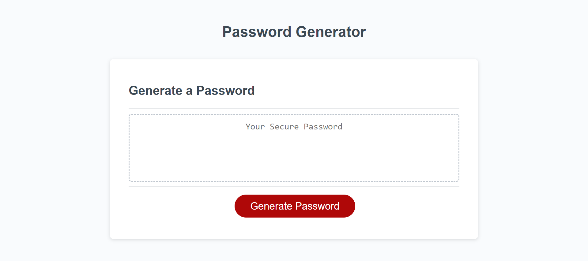

# challenge3-passwordGenerator

## Description

The motivation for the project was to modify code and create a working password generator.
This project was undertaken to better learn code JavaScript.
The updated codebase allows for a user to select characteristics that will conform the password to their needs. The user is able to select password length, and wether or not the password will include uppercase or lowercase letters, numbers, or special characters.
Through this project a better understanding of JavaScript, logic and variable manipulation were learned.

## Screenshot

## Webpage

[Link to published Password Generator](https://solomon-coding.github.io/challenge3-passwordGenerator/)

## Credits

`GoFullPage` extension was used to to take a screenshot of the webpage.

## License

None